# AI编译器-前端设计原则
相较于LLVM的单层IR设计，AI编译器一般采用多层IR设计。多层级IR的优势是IR表达上更加地灵活，可以在不同层级的IR上进行合适的PASS优化，更加便捷和高效。 但是多层级IR也存在一些劣势。首先，多层级IR需要进行不同IR之间的转换，而IR转换要做到完全兼容是非常困难的，工程工作量很大，还可能带来信息的损失。上一层IR优化掉某些信息之后，下一层需要考虑其影响，因此IR转换对优化执行的顺序有着更强的约束。其次，多层级IR有些优化既可以在上一层IR进行，也可以在下一层IR进行，让框架开发者很难选择。最后，不同层级IR定义的算子粒度大小不同，可能会给精度带来一定的影响。

## IR （Intermediate Representation）
中间表示是编译器用于表示源代码的数据结构或代码，是程序编译过程中介于源语言和目标语言之间的程序表示。传统机器学习框架的中间表示分为三大类，分别是线性中间表示，图中间表示以及混合中间表示。然而，传统编译器的中间表示难以完全满足机器学习框架对于中间表示的一系列需求。因此，机器学习框架的开发者在传统中间表示的设计基础上不断扩展，提出了很多适用于机器学习框架的中间表示。

### 线性中间表示
线性中间表示类似抽象机的汇编代码，将被编译代码表示为操作的有序序列，对操作序列规定了一种清晰且实用的顺序。由于大多数处理器采用线性的汇编语言，线性中间表示广泛应用于编译器设计。

常用线性中间表示有堆栈机代码(Stack-Machine Code)和三地址代码(Three Address Code) [2007Compilers] 。

### 图中间表示
图中间表示将编译过程的信息保存在图中，算法通过图中的对象如节点、边、列表、树等来表述。虽然所有的图中间表示都包含节点和边，但在抽象层次、图结构等方面各有不同。常见的图中间表示包括抽象语法树(Abstract Syntax Tree，AST)、有向无环图(Directed Acyclic Graph，DAG)、控制流图(Control-Flow Graph，CFG)等。

可以看到，AST形式包含 a * 5的两个不同副本，存在冗余。在AST的基础上，DAG提供了简化的表达形式，一个节点可以有多个父节点，相同子树可以重用。如果编译器能够证明
的值没有改变，则DAG可以重用子树，降低求值过程的代价.


### 混合中间表示
混合中间表示是线性中间表示和图中间表示的结合，这里以LLVM IR [2004LLVM] 为例进行说明。LLVM(Low Level Virtual Machine)是2000年提出的开源编译器框架项目，旨在为不同的前端后端提供统一的中间表示。LLVM IR使用线性中间表示表示基本块，使用图中间表示表示这些块之间的控制流，如图所示。基本块中，每条指令以静态单赋值(Static Single Assignment， SSA) [Richard1995A] 形式呈现，这些指令构成一个指令线性列表。SSA形式要求每个变量只赋值一次，并且每个变量在使用之前定义。控制流图中，每个节点为一个基本块，基本块之间通过边实现控制转移。

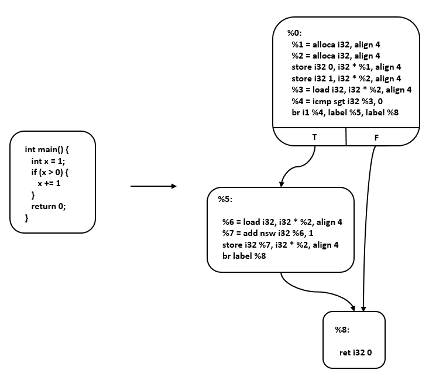


## Type System and Static Analysis
为了有效减少程序在运行时可能出现的错误，编译器的前端引入了类型系统（Type System）和静态分析（Static Analysis）系统。类型系统可以防止程序在运行时发生类型错误，而静态分析能够为编译优化提供线索和信息，有效减少代码中存在的结构性错误、安全漏洞等问题。

### 静态分析
在设计好类型系统后，编译器需要使用静态分析系统来对中间表示进行静态检查与分析。语法解析模块（parser）将程序代码解析为抽象语法树（AST）并生成中间表示。此时的中间表示缺少类型系统中定义的抽象信息，因此引入静态分析模块，对中间表示进行处理分析，并且生成一个静态强类型的中间表示，用于后续的编译优化、自动并行以及自动微分等。在编译器前端的编译过程中，静态分析可能会被执行多次，有些框架还会通过静态分析的结果判断是否终止编译优化。

静态分析模块基于抽象释义对中间表示进行类型推导、常量传播、泛型特化等操作，这些专业术语的含义分别为：

抽象释义：通过抽象解释器将语言的实际语义近似为抽象语义，只获取后续优化需要的属性，进行不确定性的解释执行。抽象值一般包括变量的类型和维度。

类型推导：在抽象释义的基础上，编译器推断出程序中变量或表达式的抽象类型，方便后续利用类型信息进行编译优化。

泛型特化：泛型特化的前提是编译器在编译期间可以进行类型推导，提供类型的上下文。在编译期间，编译器通过类型推导确定调用函数时的类型，然后，编译器会通过泛型特化，进行类型取代，为每个类型生成一个对应的函数方法。


## 机器学习中间表示

1) 张量表达。机器学习框架主要处理张量数据，因此正确处理张量数据类型是机器学习框架中间表示的基本要求。

2) 自动微分。自动微分是指对网络模型的自动求导，通过梯度指导对网络权重的优化。主流机器学习框架都提供了自动微分的功能，在设计中间表示时需要考虑自动微分实现的简洁性、性能以及高阶微分的扩展能力。

3) 计算图模式。主流机器学习框架如TensorFlow、PyTorch、MindSpore等都提供了静态图和动态图两种计算图模式，静态计算图模式先创建定义计算图，再显式执行，有利于对计算图进行优化，高效但不灵活。动态计算图模式则是每使用一个算子后，该算子会在计算图中立即执行得到结果，使用灵活、便于调试，但运行速度较低。机器学习框架的中间表示设计同时支持静态图和动态图，可以针对待解决的任务需求，选择合适的模式构建算法模型。

4) 支持高阶函数和闭包。高阶函数和闭包是函数式编程的重要特性，高阶函数是指使用其它函数作为参数、或者返回一个函数作为结果的函数，闭包是指代码块和作用域环境的结合，可以在另一个作用域中调用一个函数的内部函数，并访问到该函数作用域中的成员。支持高阶函数和闭包，可以抽象通用问题、减少重复代码、提升框架表达的灵活性和简洁性。

5) 编译优化。机器学习框架的编译优化主要包括硬件无关的优化、硬件相关的优化、部署推理相关的优化等，这些优化都依赖于中间表示的实现。

6) JIT(Just In Time)能力。机器学习框架进行编译执行加速时，经常用到JIT即时编译。JIT编译优化将会对中间表示中的数据流图的可优化部分实施优化，包括循环展开、融合、内联等。中间表示设计是否合理，将会影响机器学习框架的JIT编译性能和程序的运行能力。

针对上述需求，机器学习框架的开发者在传统中间表示的设计基础上不断扩展，提出了很多适用于机器学习框架的中间表示。接下来介绍一些主流机器学习框架的中间表示。


## MLIR
针对这个问题，TensorFlow团队提出了MLIR(Multi-Level Intermediate Represent，多级中间表示) [2020MLIR]。MLIR不是一种具体的中间表示定义，而是为中间表示提供一个统一的抽象表达和概念。 开发者可以使用MLIR开发的一系列基础设施，来定义符合自己需求的中间表示， 因此我们可以把MLIR理解为“编译器的编译器”。MLIR不局限于TensorFlow框架， 还可以用于构建连接其他语言与后端（如LLVM）的中间表示。 MLIR深受LLVM设计理念的影响，但与LLVM不同的是， MLIR是一个更开放的生态系统。 在MLIR中， 没有预设的操作与抽象类型， 这使得开发者可以更自由地定义中间表示，并更有针对性地解决其领域的问题。MLIR通过Dialect的概念来支持这种可拓展性， Dialect在特定的命名空间下为抽象提供了分组机制，分别为每种中间表示定义对应的产生式并绑定相应的Operation， 从而生成一个MLIR类型的中间表示。Operation是MLIR中抽象和计算的核心单元，其具有特定的语意，可以用于表示LLVM中所有核心的IR结构， 例如指令， 函数以及模块等。 如下就是一个MLIR定义下的Operation：
``` 
%tensor = "toy.transpose"(%tensor) {inplace = true} : (tensor<2x3xf64>) -> tensor<3x2xf64> loc("example/file/path":12:1)
```
% tensor: Operation定义的结果的名字， 
是为了避免冲突统一加入的。一个Operation可以定义0或者多个结果，它们是SSA值。

“toy.transpose”: Operation的名字。它是一个唯一的字符串，其中Dialect为Toy。因此它可以理解为Toy Dialect 中的transpose Operation。

(%tensor)：输入操作数（或参数）的列表，它们是由其它操作定义或引用块参数的 SSA 值。

{inplace = true}：零个或多个属性的字典，这些属性是始终为常量的特殊操作数。在这里，我们定义了一个名为“inplace”的布尔属性，它的常量值为 true。

(tensor<2x3xf64>)->tensor<3x2xf64>：函数形式表示的操作类型，前者是输入，后者是输出。尖括号内代表输入与输出的数据类型以及形状， 例如
代表一个形状位2X3， 数据类型为float64的张量。

loc(“example/file/path”:12:1)：此操作的源代码中的位置。

由于各层中间表示都遵循如上的样式进行定义，所以各个层级的中间表示之间可以更加方便的进行转换， 提高了中间表示转换的效率。各个不同层级的中间表示还可以协同进行优化。 此外，由于中间表示之间不再相互独立， 各层级的优化不必做到极致，而是可以将优化放到最适合的层级。 其他的中间表示只需要先转换为该层级的中间表示，就可以进行相关的优化，提高了优化的效率与开发效率。TensorFlow从图中间表示到SSA中间表示的转换也可以通过使用MLIR来进行多层转换， 使转换更加平滑， 降低了转化的难度。 针对MLIR的更多内容将会在第六章进行介绍。


## 自动微分（Automatic Differentiation）
常见的计算机程序求导的方法可以归纳为以下四种 [2015Automatic]：手工微分（Manual Differentiation）、数值微分（Numerical Differentiation）、符号微分（Symbolic Differentiation）和自动微分（Automatic Differentiation）。


## 前段优化
大多数编译优化器会由一系列的“趟”（Pass）来组成。每个“趟”以中间表示为输入，又以新生成的中间表示为输出。一个“趟”还可以由几个小的“趟”所组成。一个“趟”可以运行一次，也可以运行多次。

在编译优化中，优化操作的选择以及顺序对于编译的整体具有非常关键的作用。优化操作的选择决定了优化器能够感知中间表示中的哪些低效性，也决定了编译器将要如何去重写中间表示以消除这种低效性。优化操作的顺序决定了各趟操作的执行顺序。编译器可以根据具体需要运行不同的编译优化操作。也可以根据编译优化级别来调整优化的次数，种类以及顺序。
- 无用与不可达代码消除
  - 无用代码是指输出结果没有被任何其他代码所使用的代码。不可达代码是指没有有效的控制流路径包含该代码。删除无用或不可达的代码可以使得中间表示更小，提高程序的编译与执行速度。无用与不可达代码一方面有可能来自于程序编写者的编写失误，也有可能是其他编译优化所产生的结果。
- 常量传播、常量折叠
  - 常量传播：如果某些量为已知值的常量，那么可以在编译时刻将使用这些量的地方进行替换。
  - 常量折叠：多个量进行计算时，如果能够在编译时刻直接计算出其结果，那么变量将由常量替换。
- 公共子表达式消除
  - 如果一个表达式E已经计算过了，并且从先前的计算到现在E中所有变量的值都没有发生变化，那么E就成为了公共子表达式。对于这种表达式，没有必要花时间再对它进行计算，只需要直接用前面计算过的表达式结果代替E就可以了。


# AI编译器-后段和运行时（backend and runtime）

编译器前端主要将用户代码进行解析翻译得到计算图IR，并对其进行设备信息无关的优化，此时的优化并不考虑程序执行的底层硬件信息。编译器后端的主要职责是对前端下发的IR做进一步的计算图优化，让其更加贴合硬件，并为IR中的计算节点选择在硬件上执行的算子，然后为每个算子的输入输出分配硬件内存，最终生成一个可以在硬件上执行的任务序列。

编译器后端处于前端和硬件驱动层中间，主要负责计算图优化、算子选择和内存分配的任务。首先，需要根据硬件设备的特性将IR图进行等价图变换，以便在硬件上能够找到对应的执行算子，该过程是计算图优化的重要步骤之一。前端IR是通过解析用户代码生成的，属于一个较高的抽象层次，隐藏一些底层运行的细节信息，此时无法直接对应硬件上的算子（算子是设备上的基本计算序列，例如MatMul、Convolution、ReLU等），需要将细节信息进行展开后，才能映射到目标硬件上的算子。对于某些前端IR的子集来说，一个算子便能够执行对应的功能，此时可以将这些IR节点合并成为一个计算节点，该过程称之为**算子融合**；对于一些复杂计算，后端并没有直接与之对应的算子，但是可以通过几个基本运算的算子组合达到同样的计算效果，此时可以将前端IR节点拆分成多个小算子。在完成计算图优化之后，就要进行算子选择过程，为每个计算节点选择执行算子。算子选择是在得到优化的IR图后选取最合适的目标设备算子的过程。针对用户代码所产生的IR往往可以映射成多种不同的硬件算子，但是这些不同硬件算子的执行效率往往有很大差别，如何根据前端IR选择出最高效的算子，是算子选择的核心问题。算子选择本质上是一个模式匹配问题。其最简单的方法就是每一个IR节点对应一个目标硬件的算子，但是这种方法往往对目标硬件的资源利用比较差。现有的编译器一般都对每一个IR节点提供了多个候选的算子，算子选择目标就是从中选择最优的一个算子作为最终执行在设备上的算子。总的来说，在机器学习系统中，对前端生成的IR图上的各个节点进行拆分和融合，让前端所表示的高层次IR逐步转换为可以在硬件设备上执行的低层次IR。得到了这种更加贴合硬件的IR后，对于每个单节点的IR可能仍然有很多种不同的选择，例如可以选择不同的输入输出格式和数据类型，需要对IR图上每个节点选择出最为合适的算子，算子选择过程可以认为是针对IR图的细粒度优化过程，最终生成完整的算子序列。最后，遍历算子序列，为每个算子分配相应的输入输出内存，然后将算子加载到设备上执行计算。

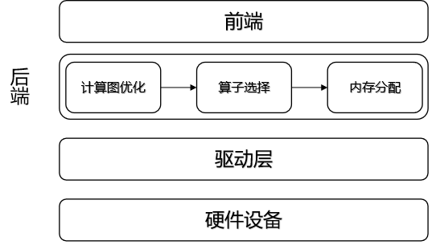


## 计算图优化
后端的计算图优化主要是针对硬件的优化，根据优化适用于所有硬件还是只适合特定硬件，可以分为：
- 通用硬件优化
- 特定硬件优化


### 通用硬件优化
通用硬件优化主要指与特定硬件类型无关的计算图优化，优化的核心是子图的等价变换：在计算图中尝试匹配特定的子图结构，找到目标子图结构后，通过等价替换方式，将其替换成对硬件更友好的子图结构。

以优化内存IO为例。深度学习算子按其对资源的需求可以分为两类： 计算密集型算子，这些算子的时间绝大部分花在计算上，如卷积、全连接等； 访存密集型算子，这些算子的时间绝大部分花在访存上，他们大部分是Element-Wise算子，例如 ReLU、Element-Wise Sum等。 在典型的深度学习模型中，一般计算密集型和访存密集型算子是相伴出现的，最简单的例子是“Conv + ReLU”。Conv卷积算子是计算密集型，ReLU算子是访存密集型算子，ReLU算子可以直接取Conv算子的计算结果进行计算，因此可以将二者融合成一个算子来进行计算，从而减少内存访问延时和带宽压力，提高执行效率。

算子类型结构的融合优化外，基于自动算子生成技术，还可以实现更灵活、更极致的通用优化。图算融合通过“**算子拆解(Expander)、算子聚合(Fusion)、算子重建(Reconstruction)**”三个主要阶段让计算图中的计算更密集，并进一步减少低效的内存访问。
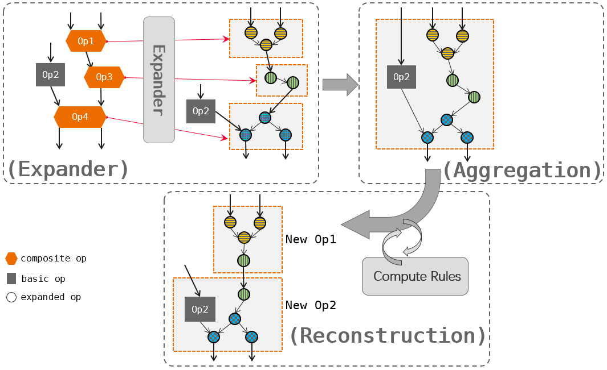

算子拆解阶段（Expander）将计算图中一些复杂算子（composite op，图中Op1、Op3、Op4）展开为计算等价的基本算子组合（ 图中虚线正方形框包围着的部分）；在算子聚合阶段（Aggregation），将计算图中将基本算子（basic op，如图中Op2）、拆解后的算子（expanded op）组合融合，形成一个更大范围的算子组合；在算子重建阶段（Reconstruction）中，按照输入tensor到输出tensor的仿射关系将基本算子进行分类：elemwise、 broadcast、reduce、transform等，并在这基础上归纳出不同的通用计算规则（如 elemwise + reduce 规则：elemwise + reduce在满足一定条件后可以高效执行），根据这些计算规则不断地从这个大的算子组合上进行分析、筛选，最终重新构建成新的算子（如图中虚线正方形包围的两个算子 New Op1 和 New Op2）。

### 特定硬件优化
特定硬件优化是指该计算图的优化是在特定硬件上才能做的优化，常见的基于硬件的优化包括由于硬件指令的限制而做的优化，特定硬件存储格式导致的优化等。
1、硬件指令限制: 在一些特定的硬件上，IR中计算节点没有直接对应的硬件算子，只能通过子图的变换来达到子图中所有算子在对应的硬件上的存在。
2、数据排布格式的限制: 针对不同特点的计算平台和不同的算子，为了追求最好的性能，一般都需要选择不同的数据排布格式（Format），而这些排布格式可能跟框架缺省的排布格式是不一样的。在这种情况下，一般的做法是算子在执行完成后对输出插入一个格式转换操作，把排布格式转换回框架的缺省排布格式，这就引入了额外的内存操作.

## 算子选择
经历了后端的图优化后，IR图中的每一个节点都有一组算子与之对应。此时的IR图中的每一个节点可以认为是用户可见的最小硬件执行单元，代表了用户代码的一个操作，对于这个操作还没有具体生成有关设备信息的细节描述。这些信息是算子选择所选择的内容信息，称之为算子信息。算子信息主要包括以下内容：

针对不同特点的计算平台和不同的算子，为了追求最好的性能，一般都需要选择不同的数据排布格式。机器学习系统常见的数据排布格式有NCHW和NHWC等。

对于不同的硬件支持不同的计算精度，例如float32、float16和int32等。算子选择需要在所支持各种数据类型的算子中选择出用户所设定的数据类型最为相符的算子。

### 数据排布格式    
在机器学习系统中常见的数据格式一般有两种，分别为NCHW类型和NHWC类型。其中N代表了数据输入的批大小，C代表了图像的通道，H和W分别代表图像输入的高和宽。图展示了BatchSize为2，通道数16和大小为5*4的数据逻辑示意图。
但是计算机的存储并不能够直接将这样的矩阵放到内存中，需要将其展平成1维后存储，这样就涉及逻辑上的索引如何映射成为内存中的索引，即如何根据逻辑数据索引来映射到内存中的1维数据索引。
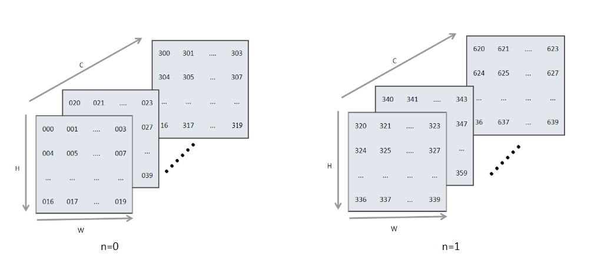

### 数据精度

通常深度学习的系统，使用的是单精度(float32)表示。这种数据类型占用32位内存。还有一种精度较低的数据类型为半精度(float16)，其内部占用了16位的内存。由于很多硬件会对半精度数据类型进行优化，半精度的计算吞吐量可以是单精度的
倍，且半精度占用的内存更小，这样可以输入更大的批大小(BatchSize)，进而减少总体训练时间。接下来详细看一下半精度浮点数与精度浮点数的区别。

### 算子选择过程
前文介绍了算子选择主要是针对IR图中的每一个操作节点选择出最为合适的算子。其中算子信息主要包括了支持设备类型、数据类型和数据排布格式三个方面。经过编译器前端类型推导与静态分析的阶段后，IR图中已经推导出了用户代码侧的数据类型。下面介绍算子选择的基本过程。


## 内存分配
内存分配模块主要负责给图中算子的输入、输出分配Device内存。用户的前端脚本经过编译器前端处理后得到中间表达，后端根据中间表达进行算子选择和相关优化，可以得到算子最终的输入输出张量的形状、数据类型（Data Type）、格式（Format）等信息，根据这些信息可以计算出算子输入、输出张量的尺寸大小。得到张量的尺寸大小后，往往还需要对内存大小进行对齐操作。内存通常以4字节、8字节或16字节为一组进行访问，如果被搬运的内存大小不是这些值的倍数，内存后面会填充相应数量的空数据以使得内存长度达到这些值的倍数。因此，访问非对齐的内存可能会更加耗时。

首先给输入张量、Conv2D的权重和Conv2D的输出分配内存地址。然后为BatchNorm的输入分配地址时，发现BatchNorm的输入就是Conv2D算子的输出，而该张量的地址已经在之前分配过了，因此只需要将Conv2D算子的输出地址共享给BatchNorm的输入，就可以避免内存的重复申请以及内存的冗余拷贝。以此类推，可以发现整个过程中可以将待分配的内存分成三种类型：
- 整张图的输入张量
- 算子的权重或者属性
- 算子的输出张量
三种类型在训练过程中的生命周期有所不同。
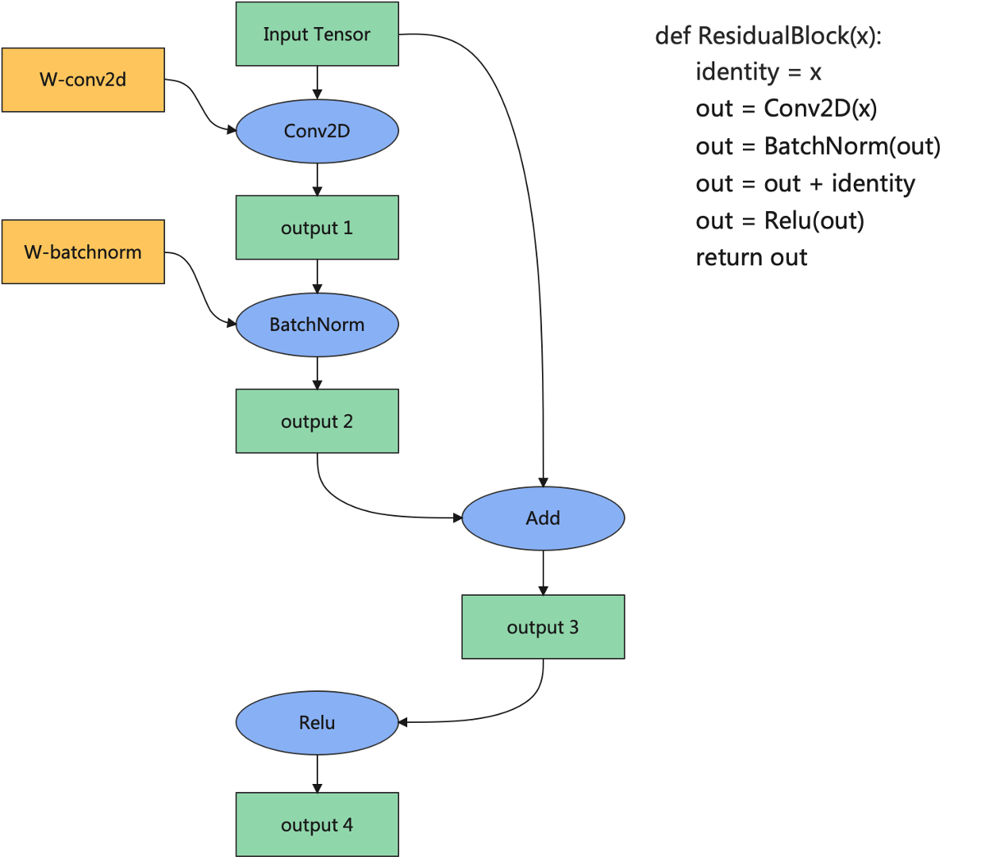

在CPU上常常使用malloc函数直接申请内存，这种方式申请内存好处是随时申请随时释放，简单易用。然而在许多对性能要求严苛的计算场景中，由于所申请内存块的大小不定，频繁申请释放会降低性能。通常会使用内存池的方式去管理内存，先申请一定数量的内存块留作备用，当程序有内存申请需求时，直接从内存池中的内存块中申请。当程序释放该内存块时，内存池会进行回收并用作后续程序内存申请时使用。 在深度学习框架中，设备内存的申请也是非常频繁的，往往也是通过内存池的方式去管理设备内存，并让设备内存的生命周期与张量的生命周期保持一致。不同的深度学习框架在内存池的设计上大同小异，

### 内存复用
在机器学习系统中，内存复用是指分析张量的生命周期，将生命周期结束的张量的设备内存释放回内存池并用于后续张量的内存分配。内存复用的目的是提高内存的利用率，让有限的设备内存容纳更大的模型。 以图，当BatchNorm算子计算结束后，输出1不再被任何算子使用，则该张量的设备内存可以被回收，并且如果输出1的内存尺寸大于等于输出3的内存尺寸，则从输出1回收的地址可以用于输出3的内存分配，从而达到复用输出1地址的目的。

内存复用策略的求解是一个NP完全的问题。许多深度学习框架通常采用贪心的策略去分配内存，例如采用BestFit算法，每次直接从内存池中选取可以满足条件的最小内存块，然而这种贪心的策略往往会陷入局部最优解，而无法求得全局最优解。

### 内存优化手段
#### 内存融合
上述内存分配的方式，都是以单个张量的维度去分配的，每个张量分配到的设备地址往往是离散的。但是对于某些特殊的算子，如AllReduce通信算子，需要为它们分配连续的内存。通信算子的执行包含通信等待、数据搬移、计算等步骤，而在大规模分布式集群的场景下，通信的耗时往往是性能瓶颈。针对这种场景，如图所示，可以将多个通信算子融合成一个，为通信算子的输入分配连续的内存，从而减少通信的次数。 又比如分布式训练中的神经网络权重初始化，通常将一个训练进程中的权重初始化，然后将该权重广播到其他进程中。当一个网络有较多权重的时候，需要多次进行广播。通常可以为所有权重分配连续的内存地址，然后广播一次，节省大量通信的耗时。
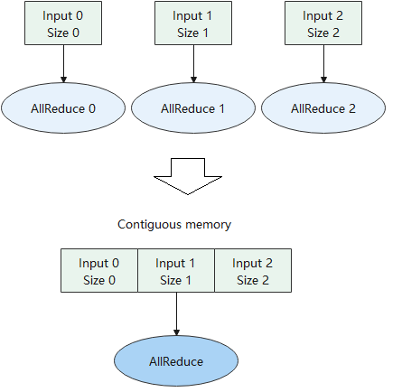

#### In-Place算子
在内存分配流程中，会为每个算子的输入和输出都分配不同的内存。然而对很多算子而言，为其分配不同的输入和输出地址，会浪费内存并且影响计算性能。例如优化器算子，其计算的目的就是更新神经网络的权重；例如Python语法中的 += 和 *= 操作符，将计算结果更新到符号左边的变量中；例如 a[0]=b 语法，将 a[0] 的值更新为 b。诸如此类计算有一个特点，都是为了更新输入的值。下面以张量的 a[0]=b 操作为例介绍In-Place的优点。 图7.4.6左边是非In-Place操作的实现，step1将张量a拷贝到张量a’，step2将张量b赋值给张量a’，step3将张量a’拷贝到张量a。 图7.4.6右边是算子In-Place操作的实现，仅用一个步骤将张量b拷贝到张量a对应的位置上。对比两种实现，可以发现In-Place操作节省了两次拷贝的耗时，并且省去了张量a’内存的申请。
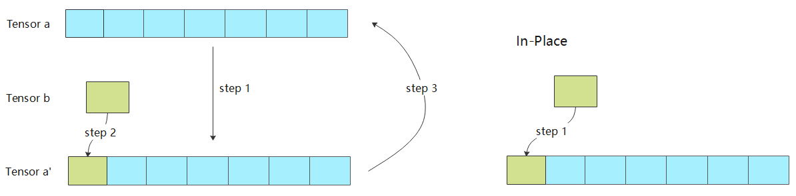


## 算子调度与执行
经过算子选择与内存分配之后，计算任务可以通过运行时完成计算的调度与在硬件上的执行。根据是否将算子编译为计算图，计算的调度可以分为单算子调度与计算图调度两种方式。而根据硬件提供的能力差异，计算图的执行方式又可以分为逐算子下发执行的交互式执行以及将整个计算图或者部分子图一次性下发到硬件的下沉式执行两种模式。

### 单算子调度
单算子调度是相对于计算图而言，算法或者模型中包含的算子通过Python语言的运行时被逐个调度执行，例如PyTorch的默认执行方式。

算子在Python侧被触发执行后，会经过机器学习框架初始化，其中需要确定包括算子的精度，输入与输出的类型和大小以及对应的硬件设备等信息，接着框架会为该算子分配计算所需的内存，最后交给具体的硬件计算设备完成计算的执行。

单算子调度方式的好处在于其灵活性，由于算子直接通过Python运行时调度，一方面可以表达任意复杂的计算逻辑，尤其是在需要复杂控制流以及需要Python原生数据结构支持来实现复杂算法的场景；另一方面单算子调度对于程序正确性的调试非常便利，开发人员可以在代码执行过程中打印任意需要调试的变量；最后一点是通过Python运行时驱动算子的方式，可以在计算中与Python庞大而丰富的生态库协同完成计算任务。

缺点：
- 难于进行计算性能的优化，原因是由于缺乏计算图的全局信息，单算子执行时无法根据上下文完成算子融合，代数化简等优化
- 缺乏计算的拓扑关系，整个计算只能串行调度执行，即无法通过运行时完成并行计算
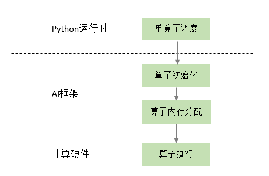

### 计算图调度
在一个典型的异构计算环境中，主要存在CPU、GPU以及NPU等多种计算设备，因此一张计算图可以由运行在不同设备上的算子组成为异构计算图。完成计算图中算子对应设备的标记以后，计算图已经准备好被调度与执行，根据硬件能力的差异，可以将异构计算图的执行分为三种模式，分别是逐算子交互式执行，整图下沉执行与子图下沉执行。

交互式执行主要针对CPU和GPU的场景，计算图中的算子按照输入和输出的依赖关系被逐个调度与执行；而整图下沉执行模式主要是针对NPU芯片而言，这类芯片主要的优势是能够将整个神经网络的计算图一次性下发到设备上，无需借助主机的CPU能力而独立完成计算图中所有算子的调度与执行，减少了主机和芯片的交互次数，借助NPU的张量加速能力，提高了计算效率和性能；子图下沉执行模式是前面两种执行模式的结合，由于计算图自身表达的灵活性，对于复杂场景的计算图在NPU芯片上进行整图下沉执行的效率不一定能达到最优，因此可以将对于NPU芯片执行效率低下的部分分离出来，交给CPU或者GPU等执行效率更高的设备处理，而将部分更适合NPU计算的子图下沉到NPU进行计算，这样可以兼顾性能和灵活性两方面。

上述异构计算图可以实现两个目的，一个是异构硬件加速，将特定的计算放置到合适的硬件上执行；第二个是实现算子间的并发执行，从计算图上可以看出，kernel_1和kernel_2之间没有依赖关系，kernel_3和kernel_4之间也没有依赖关系，因此这两组CPU和GPU算子在逻辑上可以被框架并发调用，而kernel_5依赖kernel_3和kernel_4的输出作为输入，因此kernel_5需要等待kernel_3和kernel_4执行完成后再被触发执行。

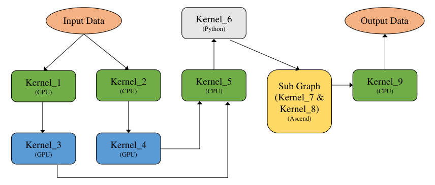


### 交互式执行
交互式执行模式下，框架的运行时根据计算图中算子的依赖关系，按照某种执行序（例如广度优先序）逐个将算子下发到硬件上执行。

#### 非异构计算图执行方式
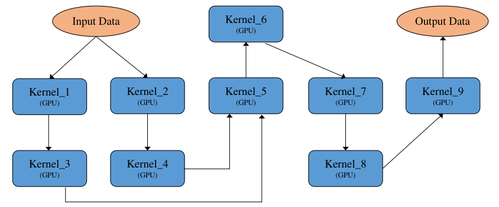
- 串行执行：将计算图展开为执行序列，按照执行序逐个串行执行，如图。其特点为执行顺序固定，单线程执行，对系统资源要求相对较低。
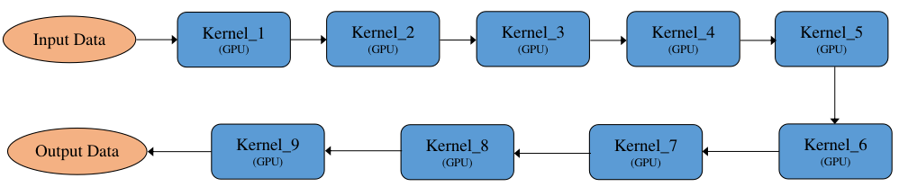
- 并行执行：将计算图按照算子之间的依赖关系展开，有依赖关系的算子通过输入依赖保证执行顺序，没有依赖关系的算子则可以并行执行，如图所示，Kernel_1和Kernel_2没有依赖可以并行执行，Kernel_3和Kernel_4没有依赖可以并行执行。其特点为执行顺序不固定，每轮执行的算子顺序大概率不一样，多线程执行，对系统资源要求相对较高。
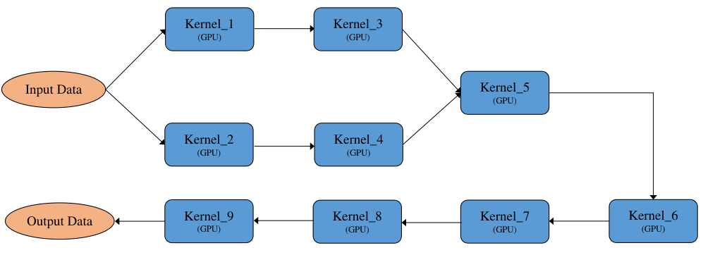


#### 异构计算图执行方式
下图是一张异构计算图，其中Kernel_1、Kernel_2、Kernel_5、Kernel_9为CPU算子，Kernel_6为python算子（执行也是在CPU上），Kernel_3和Kernel_4为GPU算子，Kernel_7和Kernel_8为GPU算子。 一般来说计算图的优化都是基于非异构计算图来实现的，要求计算图中的算子为同一设备上的，方便算子间的融合替换等优化操作，因此需要将一张异构计算图切分为多个非异构计算图，这里切分就比较灵活了，可以定义各种切分规则，一般按照产生尽量少的子图的切分规则来切分，尽量将多的同一设备上的算子放在一张子图中，如 图7.5.10所示，最后产生5张子图：Graph_1_CPU、Graph_2_GPU、Graph_3_CPU、Graph_4_Ascend、Graph_5_CPU。
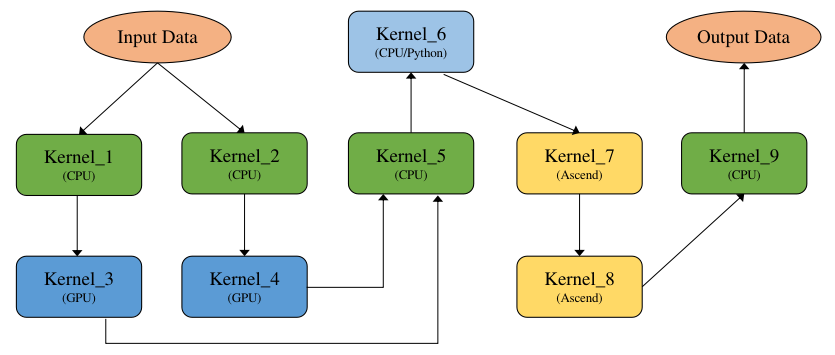
- 将切分后的多个子图分开执行，即一个子图执行完再执行另一个子图，如图所示，上一个子图的输出数据会传输给下一个子图的输入数据，并且下一个子图需要将输入数据拷贝为本图的device数据，如Graph_2_GPU需要将Graph_1_CPU的输出数据从CPU拷贝到GPU，反过来Graph_3_CPU需要将Graph2GPU的输出数据从GPU拷贝到CPU，子图之间互相切换执行有一定的开销。
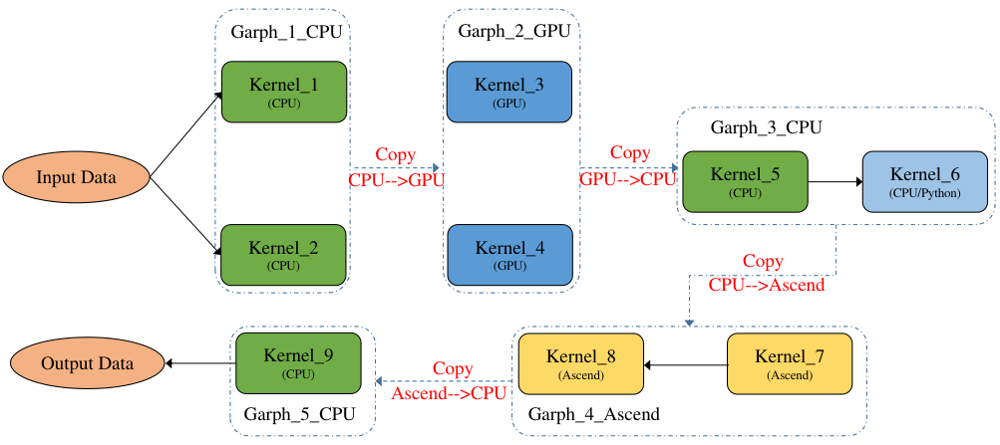
- 将切分后的多个子图进行合并，合并为一个整体的DAG执行，如图所示，通过算子的设备属性来插入拷贝算子以实现不同设备上的算子数据传输，并且拷贝算子也是进入整图中的，从而形成一个大的整图执行，减少子图之间的切换执行开销。


前面讲述了非异构计算图的两种执行方式和异构计算图的两种执行方式，其中异构计算图又是在非异构计算图的基础之上，因此异构计算图按照两两组合共有四种执行方式。

### 下沉式执行
下沉式执行是通过专用芯片的SoC架构，将整个或部分计算图一次性调度到芯片上以完成全量数据的计算。


## 算子编译器
算子编译器，顾名思义，即对算子进行编译优化的工具。算子编译器为了实现较好地优化加速，会根据现代计算机体系结构特点，将程序运行中的每个细小操作抽象为“调度策略”。如果不考虑优化和实际中芯片的体系结构特点，只需要按照算子表达式的计算逻辑，把输入进来的张量全部加载进计算核心里完成计算，之后再把计算结果从计算核心里面取出并保存下来即可。这里的计算逻辑指的就是基本数学运算（如加、减、乘、除）以及其他函数表达式（如卷积、转置、损失函数）等。

基于现代存储结构这一硬件设计的事实，有局部性（Locality）概念：
（1）时间局部性，相对较短时间内重复访问特定内存位置。如多次访问L1高速缓存的同一位置的效率会高于多次访问L1中不同位置的效率。
（2）空间局部性，在相对较近的存储位置进行访问。如，多次访问L1中相邻位置的效率会高于来回在L1和主存跳跃访问的效率。

满足这两者任一都会有较好的性能提升。基于局部性概念，希望尽量把需要重复处理的数据放在固定的内存位置，且这一内存位置离处理器越近越好，以通过提升访存速度而进行性能提升。

以上种种在程序实际运行的时候针对数据做出的特殊操作，统称为调度（Schedule）。调度定义了：
（1）应该在何时何处计算函数中的每个值？
（2）数据应该储存在哪里？
（3）每个值在多个消费者（Consumer）之间访存需要花费多长时间？另外在何时由每个消费者独立重新计算？这里的消费者指使用前序结构进行计算的值。

### 优化策略
1. 子策略组合优化：将抽象出来的调度策略进行组合，拼接排布出一个复杂而高效的调度集合。子策略组合优化，本质上还是基于人工手动模板匹配的优化方式，依赖于开发人员对于硬件架构有较深的理解。这种方式较为直接，但组合出的优化策略无法调优，同时对各类算子精细化的优化也带来较多的人力耗费。
2. 调度空间算法优化： 通过对调度空间搜索/求解，自动生成对应算子调度。此类方案包括多面体模型编译（Polyhedral Compilation）（基于约束对调度空间求解）和Ansor（调度空间搜索）等。这类方法的好处是提升了算子编译的泛化能力，缺点是搜索空间过程会导致编译时间过长。 以多面体模型编译技术将代码的多层循环抽象为多维空间，将每个计算实例抽象为空间中的点，实例间的依赖关系抽象为空间中的线，主要对循环进行优化。该算法的主要思想是针对输入代码的访存特点进行建模，调整循环语句中的每一个实例的执行顺序，使得新调度下的循环代码有更好的局部性和并行性。

### 算子表达能力
算子表达能力指的是：算子编译器的前端识别输入代码，并在不损失语义信息的情况下转换为中间表示的能力。算子编译器承接的前端输入往往是PyTorch等的Python形式的代码，而Python中各种灵活的表达方式（包括而不限于索引、View语义等）对算子编译器的前端表达能力提出了较高要求。另外在检测网络中，输入算子往往还有大量的控制流语句。此外，还经常可以看到神经网络中存在许多的动态形状问题，即网络中的算子形状会受网络迭代次数和控制流等条件的影响。这些都对算子编译器前端的表达能力提出了很高的要求。

在实际工程实践中，发现大量的长尾分布般不常见但性能很差的算子（后文简称为长尾算子）往往是整体网络训练或推理的瓶颈点。而这些长尾算子大都是由于其出现频次低而不至于实现在计算库中。同时其语法过于灵活或存在大量的控制流语句以及动态形状问题而难以被目前的算子编译器前端充分表达出来，因此也难以通过算子编译器进行优化加速。于是，这些长尾算子只好以运行速度较慢的Python解释器或者虚拟机的方式执行，从而成为整个网络中的性能瓶颈。此时，提高算子编译器前端的表达能力就成为了重中之重。


# 硬件加速器
## 存储单元
寄存器文件（Register File）：片上最快的存储器，但与CPU不同，GPU的每个SM（流多处理器）有上万个寄存器。尽管如此当每个线程使用过多的寄存器时，SM中能够调度的线程块数量就会受到限制，可执行的线程总数量会因此受到限制，可执行的线程数量过少会造成硬件无法充分的利用，性能急剧下降。所以要根据算法的需求合理使用寄存器。

共享内存（Shared Memory）：共享内存实际上是用户可控的一级缓存，每个SM（流多处理器）中有128KB的一级缓存, 开发者可根据应用程序需要配置最大96KB的一级缓存作为共享内存。共享内存的访存延迟极低，只有几十个时钟周期。共享内存具有高达1.5TB/s的带宽，远远高于全局内存的峰值带宽900GB/s。共享内存的使用对于高性能计算工程师来说是一个必须要掌握的概念。

全局内存（Global Memory）：全局内存之所以称为全局，是因为GPU与CPU都可以对它进行读写操作。全局内存对于GPU中的每个线程都是可见的，都可以直接对全局内存进行读写操作。CPU等其他设备可以通过PCI-E总线对其进行读写操作。全局内存也是GPU中容量最大的一块内存，可达16GB之多。同时也是延迟最大的内存，通常有高达上百个时钟周期的访存延迟。

常量内存（Constant Memory）：常量内存其实只是全局内存的一种虚拟地址形式，并没有真正的物理硬件内存块。常量内存有两个特性，一个是高速缓存，另一个更重要的特性是它支持将某个单个值广播到线程束中的每个线程中。

纹理内存（Texture Memory）：纹理内存是全局内存的一个特殊形态。当全局内存被绑定为纹理内存时，执行读写操作将通过专用的纹理缓存来加速。在早期的GPU上没有缓存，因此每个SM上的纹理内存为设备提供了唯一真正缓存数据的方法。然而随着硬件的升级，一级缓存和二级缓存的出现使得纹理缓存的这项优势已经荡然无存。纹理内存的另外一个特性，也是最有用的特性就是当访问存储单元时，允许GPU实现硬件相关的操作。比如说使用纹理内存，可以通过归一化的地址对数组进行访问，获取的数据可以通过硬件进行自动插值，从而达到快速处理数据的目的。此外对于二维数组和三维数组，支持硬件级的双线性插值与三线性插值。纹理内存另一个实用的特性是可以根据数组的索引自动处理边界条件，不需要对特殊边缘进行处理即可完成数组内元素操作，从而防止线程中分支的产生。

## 硬件加速计算单元
标量计算单元：与标准的精简指令运算集（Reduced Instruction Set Computer，RISC）相似，一次计算一个标量元素。

一维向量计算单元：一次可以完成多个元素的计算，与传统的CPU和GPU架构中单指令多数据（SIMD）相似，已广泛应用于高性能计算（High Performance Computing，HPC）和信号处理中。

二维向量计算单元：一次运算可以完成一个矩阵与向量的内积，或向量的外积。利用数据重复使用这一特性，降低数据通信成本与存储空间，更高效的提高矩阵乘法性能。

三维向量计算单元：一次完成一个矩阵的乘法，专为神经网络应用设计的计算单元，更充分利用数据重复特性，隐藏数据通信带宽与数据计算的差距。

GPU计算单元主要由标量计算单元和三维向量计算单元组成。

## 编程接口
算子库层级：如cuBLAS基本矩阵与向量运算库，cuDNN深度学习加速库，均通过Host端调用算子库提供的核函数使能张量计算核心；

编程原语层级：如基于CUDA的WMMA API编程接口。同算子库相比，需要用户显式调用计算各流程，如矩阵存取至寄存器、张量计算核心执行矩阵乘累加运算、张量计算核心累加矩阵数据初始化操作等；

指令层级：如PTX ISA MMA指令集，提供更细粒度的mma指令，便于用户组成更多种形状的接口，通过CUDA Device端内联编程使能张量计算核心。

## 算子编译器
随着深度学习模型的迭代更新及各类AI芯片的层出不穷，基于人工优化算子的方式给算子开发团队带来沉重的负担。
TVM/Ansor：

TVM是陈天奇博士等人开发的开源深度学习编译框架，提供了端到端的编译优化（图优化/算子优化）能力，在工业界应用较广。在架构上，主要包括Relay和TIR两层。通过Relay导入推理模型，进行算子融合等图层优化，通过TIR生成融合算子。在算子编译方面，TVM采用了计算和调度分离的技术，为不同的算子提供了不同的模板，同时支持自定义模板，优化特定算子类型调度。为了更进一步优化算子性能，TVM支持对算子进行自动调优，来生成较优的切分参数。此外，为了简化用户开发模板的工作，TVM在0.8版本后提供了自动调度能力Ansor，通过搜索的方式，为目标算子生成调度及切分参数。
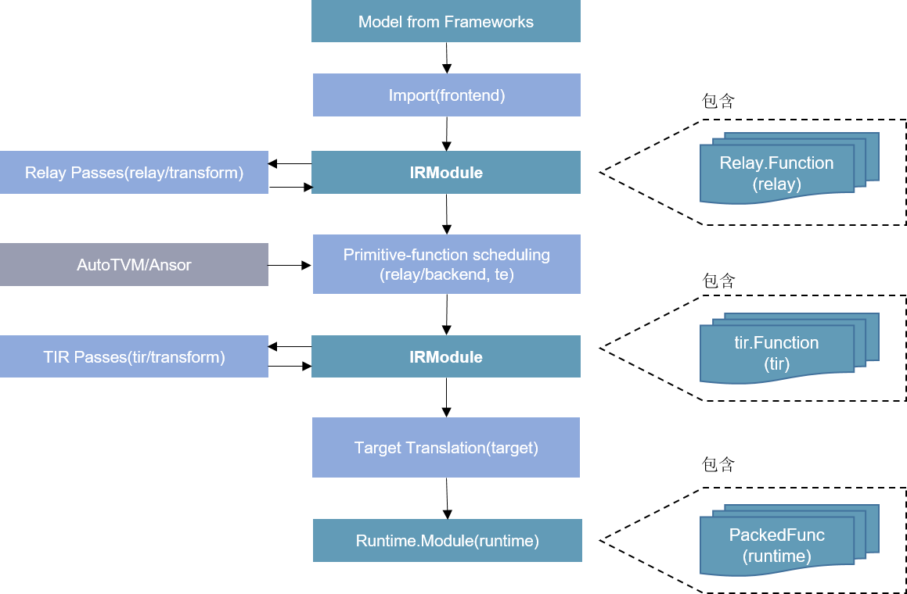

# Reference
[Compiler-FrontEnd](https://openmlsys.github.io/chapter_frontend_and_ir/ai_compiler_design_principle.html)
